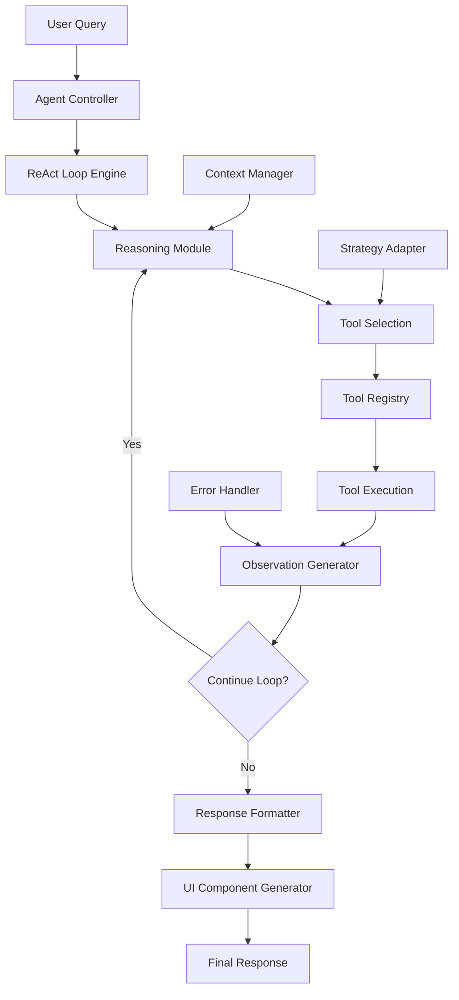
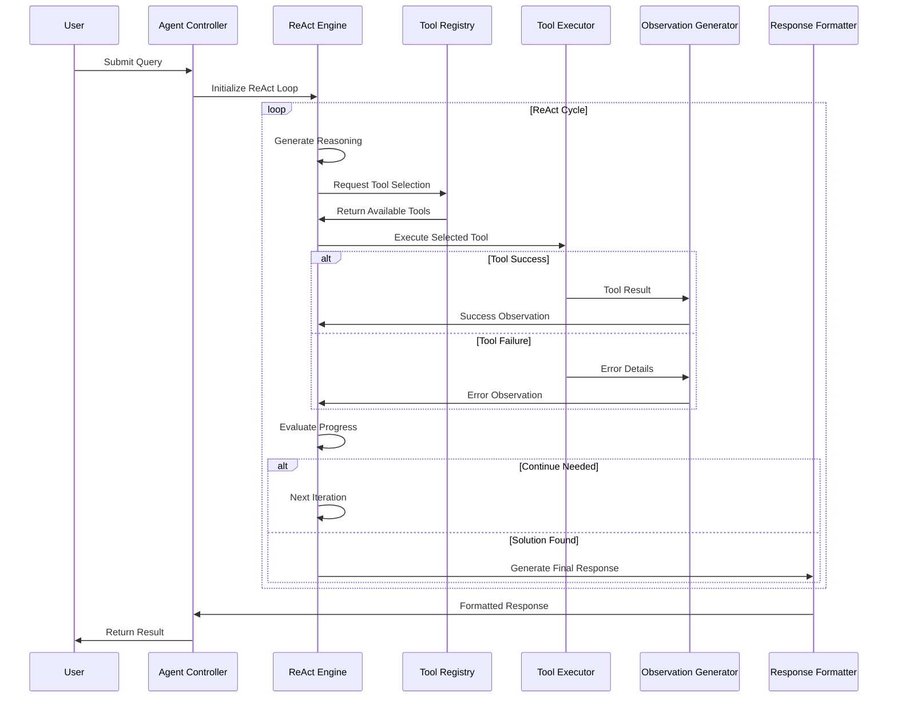
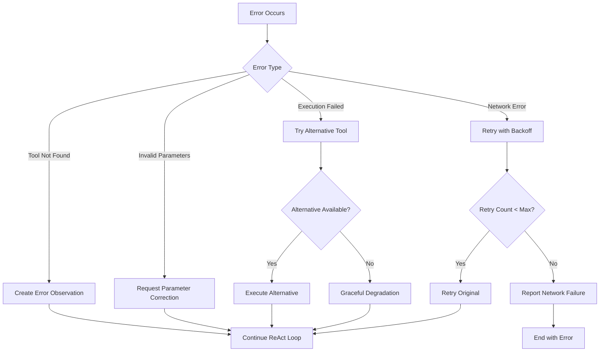

# Design Document

## Overview

The AI Agent Enhancement transforms the existing AI Chat Dynamic UI application into a sophisticated reasoning agent system. Building on the current Next.js architecture with Mistral LLM integration and VM2 sandboxing, this enhancement introduces a ReAct (Reasoning and Acting) loop, preset tools, dynamic decision-making, and modular agent architecture.

The design maintains the existing security model while adding intelligent tool selection, error recovery, and adaptive reasoning capabilities. The agent will be able to break down complex problems, select appropriate tools, handle failures gracefully, and learn from feedback to improve its problem-solving approach.

## Architecture

### High-Level Agent Architecture



### Enhanced System Flow



## Components and Interfaces

### 1. Agent Controller (`core/agentController.js`)

The main orchestrator that manages the agent lifecycle and coordinates between components.

```javascript
interface AgentController {
  processQuery(userQuery: string): Promise<AgentResponse>
  initializeAgent(): void
  resetAgent(): void
  getAgentStatus(): AgentStatus
}

interface AgentResponse {
  success: boolean
  reasoning: string[]
  actions: Action[]
  observations: Observation[]
  finalAnswer: string
  uiComponents?: ComponentDefinition[]
  error?: AgentError
}
```

### 2. ReAct Loop Engine (`core/reactEngine.js`)

Implements the core reasoning and acting cycle with configurable iteration limits and termination conditions.

```javascript
interface ReActEngine {
  executeLoop(query: string, context: AgentContext): Promise<ReActResult>
  generateReasoning(context: AgentContext): Promise<string>
  selectAction(reasoning: string, availableTools: Tool[]): Promise<Action>
  processObservation(observation: Observation): AgentContext
  shouldContinue(context: AgentContext): boolean
}

interface ReActResult {
  iterations: ReActIteration[]
  finalReasoning: string
  success: boolean
  terminationReason: string
}
```

### 3. Tool Registry (`core/toolRegistry.js`)

Centralized management system for all available tools with validation and categorization.

```javascript
interface ToolRegistry {
  registerTool(tool: Tool): void
  getTool(name: string): Tool | null
  getAvailableTools(category?: string): Tool[]
  validateTool(tool: Tool): boolean
  searchTools(query: string): Tool[]
}

interface Tool {
  name: string
  description: string
  category: string
  parameters: ParameterSchema[]
  execute(params: object): Promise<ToolResult>
  validate(params: object): boolean
}
```

### 4. Preset Tools (`tools/`)

#### Area Calculator (`tools/areaCalculator.js`)
```javascript
interface AreaCalculator extends Tool {
  calculateTriangle(base: number, height: number): number
  calculateRectangle(width: number, height: number): number
  calculateCircle(radius: number): number
}
```

#### Percentage Calculator (`tools/percentageCalculator.js`)
```javascript
interface PercentageCalculator extends Tool {
  calculatePercentage(value: number, total: number): number
  calculatePercentageIncrease(original: number, new: number): number
  calculatePercentageOf(percentage: number, total: number): number
}
```

#### Mock Services (`tools/mockServices.js`)
```javascript
interface WeatherService extends Tool {
  getWeather(location: string): Promise<WeatherData>
}

interface FlightService extends Tool {
  searchFlights(from: string, to: string, date: string): Promise<FlightData[]>
}
```

### 5. Observation Generator (`core/observationGenerator.js`)

Creates structured observations from tool results and errors to feed back into the reasoning loop.

```javascript
interface ObservationGenerator {
  createSuccessObservation(toolResult: ToolResult): Observation
  createErrorObservation(error: Error, context: string): Observation
  createProgressObservation(progress: string): Observation
}

interface Observation {
  type: 'success' | 'error' | 'progress'
  content: string
  timestamp: Date
  toolName?: string
  data?: any
}
```

### 6. Enhanced AI Service (`core/enhancedAIService.js`)

Extends the existing AI service with agent-specific prompting and response parsing.

```javascript
interface EnhancedAIService extends AIService {
  generateAgentReasoning(context: AgentContext): Promise<string>
  parseToolSelection(response: string): Action
  generateFinalResponse(context: AgentContext): Promise<string>
}
```

## Data Models

### Agent Context
```javascript
interface AgentContext {
  originalQuery: string
  currentIteration: number
  maxIterations: number
  reasoning: string[]
  actions: Action[]
  observations: Observation[]
  availableTools: Tool[]
  strategy: string
  confidence: number
}
```

### Action Definition
```javascript
interface Action {
  type: 'tool_call' | 'reasoning' | 'final_answer'
  toolName?: string
  parameters?: object
  reasoning: string
  timestamp: Date
}
```

### Tool Result
```javascript
interface ToolResult {
  success: boolean
  data: any
  message: string
  executionTime: number
  metadata?: object
}
```

## Error Handling

### Error Recovery Strategy

The agent implements a multi-layered error recovery approach:

1. **Tool-Level Recovery**: Individual tools handle their own validation and provide meaningful error messages
2. **Observation-Based Recovery**: Errors are converted to observations that inform the next reasoning step
3. **Strategy Adaptation**: The agent can change its approach based on error patterns
4. **Graceful Degradation**: If preferred tools fail, the agent attempts alternative approaches

### Error Categories

```javascript
enum ErrorType {
  TOOL_NOT_FOUND = 'tool_not_found',
  INVALID_PARAMETERS = 'invalid_parameters',
  TOOL_EXECUTION_FAILED = 'tool_execution_failed',
  REASONING_FAILED = 'reasoning_failed',
  MAX_ITERATIONS_REACHED = 'max_iterations_reached',
  NETWORK_ERROR = 'network_error'
}
```

### Error Handling Flow



## Testing Strategy

Since this is a learning project without formal testing frameworks, the testing approach focuses on:

### Manual Testing Scenarios

1. **Single Tool Usage**: Test each preset tool individually with various inputs
2. **Multi-Tool Workflows**: Test scenarios requiring multiple tools in sequence
3. **Error Recovery**: Deliberately trigger errors to test recovery mechanisms
4. **Edge Cases**: Test with invalid inputs, network failures, and resource limits

### Validation Points

1. **Tool Registration**: Verify all tools are properly registered and discoverable
2. **ReAct Loop**: Ensure proper iteration and termination conditions
3. **Error Handling**: Confirm errors are converted to useful observations
4. **Response Quality**: Validate that final responses are coherent and helpful

### Development Testing Approach

```javascript
// Example manual testing utilities
class AgentTester {
  async testSingleTool(toolName, params) {
    // Test individual tool execution
  }
  
  async testReActLoop(query, expectedIterations) {
    // Test complete agent workflow
  }
  
  async testErrorRecovery(errorScenario) {
    // Test error handling and recovery
  }
}
```

## Integration with Existing System

### Backward Compatibility

The enhanced agent system maintains full backward compatibility with the existing chat interface:

- Existing API endpoints (`/api/chat`, `/api/calculate`) remain functional
- Current UI components continue to work without modification
- The agent enhancement is additive, not replacing existing functionality

### Migration Strategy

1. **Phase 1**: Implement core agent components alongside existing system
2. **Phase 2**: Add preset tools and tool registry
3. **Phase 3**: Integrate ReAct loop with existing AI service
4. **Phase 4**: Enhance UI to display agent reasoning and actions

### API Enhancement

```javascript
// Enhanced API response format
interface EnhancedChatResponse {
  // Existing fields
  reasoning: string
  uiComponents: ComponentDefinition[]
  hasUI: boolean
  
  // New agent fields
  agentMode: boolean
  iterations: ReActIteration[]
  toolsUsed: string[]
  finalConfidence: number
  strategy: string
}
```

## Security Considerations

### Tool Execution Security

- All tools execute within the existing VM2 sandbox environment
- Tool parameters are validated and sanitized before execution
- Network access is restricted to predefined mock services
- Resource limits prevent infinite loops and memory exhaustion

### Agent Behavior Constraints

- Maximum iteration limits prevent infinite reasoning loops
- Tool execution timeouts prevent hanging operations
- Input validation ensures malicious queries are rejected
- Observation sanitization prevents injection attacks

## Performance Optimization

### Caching Strategy

- Tool results are cached for identical parameter sets
- Reasoning patterns are memoized for similar query types
- Tool registry maintains indexed lookups for fast tool discovery

### Resource Management

- Iteration limits prevent excessive API calls
- Tool execution is parallelized where possible
- Memory usage is monitored and limited per agent session

## Extensibility

### Adding New Tools

The modular architecture allows easy addition of new tools:

```javascript
// Example new tool implementation
class NewCalculatorTool extends BaseTool {
  constructor() {
    super('new-calculator', 'Performs new type of calculation', 'math');
  }
  
  async execute(params) {
    // Tool implementation
  }
}

// Registration
toolRegistry.registerTool(new NewCalculatorTool());
```

### Extending Reasoning Capabilities

The ReAct engine can be enhanced with:
- Custom reasoning strategies
- Domain-specific prompting
- Advanced termination conditions
- Learning from user feedback

This design provides a solid foundation for building an intelligent agent system while maintaining the security, performance, and usability of the existing application.