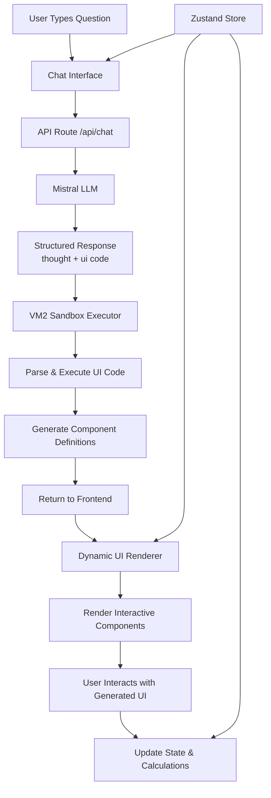
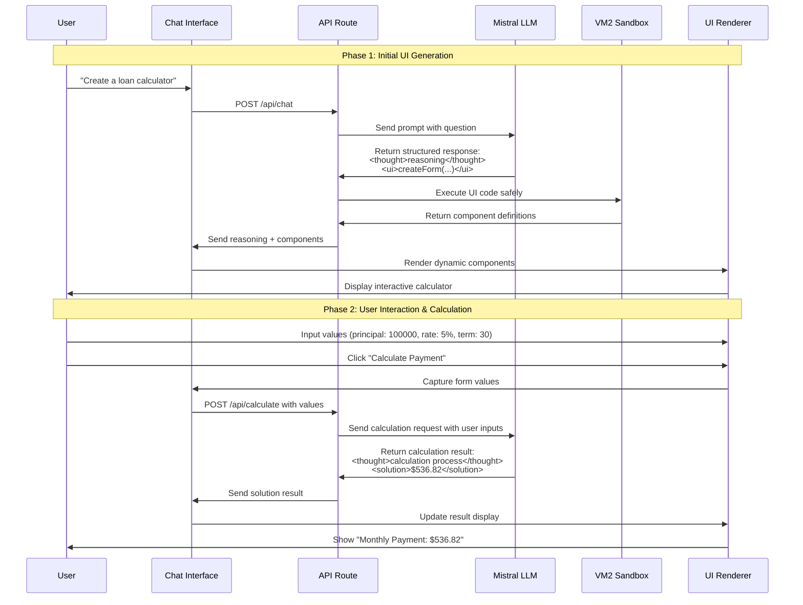

# Design Document

## Overview

The AI-Chat Dynamic UI application is a Next.js 14 web application that enables users to ask mathematical questions and receive both explanatory responses and interactive UI components. The system leverages Mistral LLM for intelligent responses, VM2 for secure code execution, and modern React patterns for dynamic UI rendering.

The architecture follows a clear separation between the chat interface, AI integration, secure code execution, and dynamic UI rendering, ensuring both security and extensibility.

## Architecture

### High-Level Architecture



### Dynamic UI Rendering Flow



### Enhanced API Endpoints

The system now supports two API endpoints:

1. **POST /api/chat** - Initial UI generation
2. **POST /api/calculate** - Process user inputs and return calculations

### Technology Stack Integration

- **Next.js 14**: App router for API routes and server-side processing
- **React 18**: Component-based UI with hooks for state management
- **Zustand**: Lightweight state management for chat and UI state
- **Tailwind CSS + Shadcn/ui**: Styling and pre-built components
- **VM2**: Secure JavaScript sandbox for AI-generated code execution
- **Mistral API**: LLM integration for intelligent responses

## Components and Interfaces

### Core Components

#### 1. Chat Interface (`components/copilot/`)

**ChatView.jsx**
- Main chat container component
- Manages message display and input handling
- Integrates with Zustand store for state management

**Messages.jsx**
- Renders individual messages (user/AI)
- Handles dynamic UI component rendering within messages
- Supports both text content and interactive UI elements
- Processes component definitions from AI responses and renders them as React components

#### 4. Dynamic UI Renderer (`components/ui/`)

**DynamicUIRenderer.jsx**
- Takes component definitions from AI responses
- Converts safe component definitions to React elements
- Handles user interactions with generated components
- Manages component state and calculations
- Supports forms, inputs, buttons, and display elements

**ComponentFactory.js**
- Factory functions for creating React components from definitions
- Maps component types to actual React implementations
- Handles props validation and event binding
- Ensures security through component whitelisting

**Copilot.jsx**
- Root copilot component wrapper
- Manages overall chat state and API communication

#### 2. API Layer (`app/api/chat/`)

**route.js**
- POST endpoint for chat messages
- Integrates with Mistral LLM API
- Handles response parsing and UI code execution
- Returns structured responses with reasoning and UI components

#### 3. Core Logic (`core/`)

**aiService.js**
- Mistral API integration
- Prompt engineering for structured responses
- Response parsing for thought and UI sections

**sandboxExecutor.js**
- VM2 sandbox configuration and execution
- Safe function definitions (createElement, createInput, etc.)
- Security policies and error handling

**uiGenerator.js**
- UI component factory functions
- Component validation and sanitization
- Integration with React rendering system

### State Management

#### Zustand Store Structure

```javascript
{
  messages: [
    {
      id: string,
      type: 'user' | 'ai',
      content: string,
      uiComponents?: ComponentDefinition[],
      timestamp: Date
    }
  ],
  isLoading: boolean,
  currentInput: string,
  uiState: {
    [componentId]: any // Dynamic UI component states
  }
}
```

### API Interfaces

#### Chat API Request/Response

**Request:**
```javascript
{
  message: string,
  context?: string
}
```

**AI Response Format (from Mistral):**
```xml
<thought>
I'll create a loan calculator with input fields for principal, rate, and term, 
then calculate monthly payments using the standard loan formula.
</thought>
<ui>
createForm({}, [
  createElement('h3', {}, ['Loan Payment Calculator']),
  createInput({name: 'principal', type: 'number', placeholder: 'Loan amount'}),
  createInput({name: 'rate', type: 'number', placeholder: 'Interest rate (%)'}),
  createInput({name: 'term', type: 'number', placeholder: 'Term (years)'}),
  createButton({onClick: 'calculatePayment'}, 'Calculate Payment'),
  createElement('div', {id: 'result'}, ['Monthly Payment: $0'])
])
</ui>
```

**API Response:**
```javascript
{
  reasoning: string, // Content from <thought> tags
  uiComponents: ComponentDefinition[], // Parsed from <ui> tags
  error?: string
}
```

#### Calculate API Request/Response

**Request:**
```javascript
{
  action: 'calculate',
  componentId: string,
  values: {
    [fieldName]: any
  },
  context: string // Original question context
}
```

**AI Calculation Response Format:**
```xml
<thought>
To calculate the monthly loan payment, I'll use the formula:
M = P * [r(1+r)^n] / [(1+r)^n - 1]
Where P = 100000, r = 0.05/12 = 0.004167, n = 30*12 = 360
</thought>
<solution>$536.82</solution>
```

**API Response:**
```javascript
{
  reasoning: string, // Content from <thought> tags
  solution: string, // Content from <solution> tags
  error?: string
}
```

#### Component Definition Structure

```javascript
{
  id: string,
  type: 'form' | 'input' | 'button' | 'display',
  props: object,
  children?: ComponentDefinition[],
  handlers?: {
    [eventName]: string // Function code to execute
  }
}
```

## Data Models

### Message Model

```javascript
class Message {
  constructor(id, type, content, uiComponents = null) {
    this.id = id;
    this.type = type; // 'user' | 'ai'
    this.content = content;
    this.uiComponents = uiComponents;
    this.timestamp = new Date();
  }
}
```

### UI Component Model

```javascript
class UIComponent {
  constructor(type, props, children = [], handlers = {}) {
    this.id = generateId();
    this.type = type;
    this.props = props;
    this.children = children;
    this.handlers = handlers;
  }
  
  validate() {
    // Validation logic for security
  }
}
```

### Safe Function Definitions

The VM2 sandbox will expose these safe functions:

```javascript
const safeFunctions = {
  createElement: (tag, props, children) => ({
    type: 'element',
    tag,
    props: sanitizeProps(props),
    children: Array.isArray(children) ? children : [children]
  }),
  
  createInput: (props) => ({
    type: 'input',
    props: sanitizeInputProps(props)
  }),
  
  createButton: (props, text) => ({
    type: 'button',
    props: sanitizeProps(props),
    text
  }),
  
  createForm: (props, children) => ({
    type: 'form',
    props: sanitizeProps(props),
    children
  })
};
```

## Error Handling

### API Error Handling

1. **LLM API Failures**: Graceful degradation with error messages
2. **Sandbox Execution Errors**: Safe error containment and user notification
3. **Malformed Responses**: Response validation and fallback handling
4. **Network Issues**: Retry logic and offline state management

### Security Error Handling

1. **Code Injection Attempts**: VM2 sandbox containment
2. **Unsafe Function Calls**: Whitelist validation
3. **Resource Exhaustion**: Execution timeouts and memory limits
4. **XSS Prevention**: Props sanitization and content validation

### Error Response Format

```javascript
{
  error: {
    type: 'api_error' | 'sandbox_error' | 'validation_error',
    message: string,
    details?: object
  }
}
```


## Security Considerations

### VM2 Sandbox Configuration

```javascript
const sandboxOptions = {
  timeout: 5000, // 5 second execution limit
  sandbox: {
    // Only expose safe functions
    createElement,
    createInput,
    createButton,
    createForm
  },
  // Disable dangerous Node.js modules
  require: false,
  wrapper: 'none'
};
```

### Content Sanitization

1. **Props Sanitization**: Remove dangerous attributes and event handlers
2. **Content Validation**: Ensure generated content matches expected patterns
3. **Function Whitelisting**: Only allow predefined safe functions
4. **Output Validation**: Validate component definitions before rendering

### API Security

1. **Environment Variables**: Secure API key storage
2. **Rate Limiting**: Prevent API abuse
3. **Input Validation**: Sanitize user inputs before LLM processing
4. **CORS Configuration**: Appropriate cross-origin policies