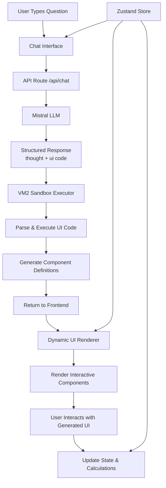
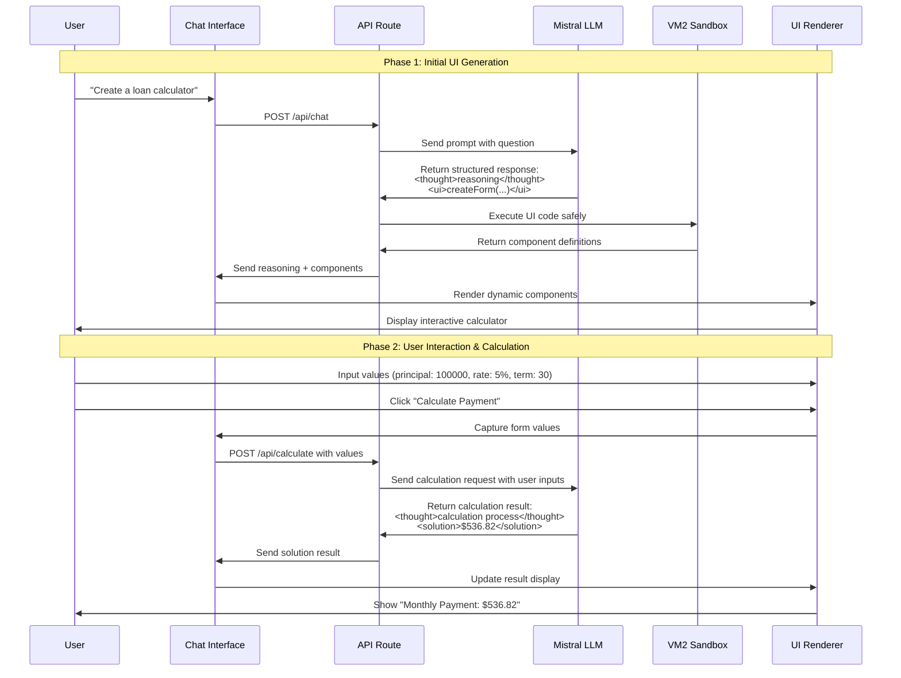

# Design Document

## Overview

The AI-Chat Dynamic UI application is a Next.js 14 web application that enables users to ask mathematical questions and receive both explanatory responses and interactive UI components. The system leverages Mistral LLM for intelligent responses, VM2 for secure code execution, and modern React patterns for dynamic UI rendering.

The architecture follows a clear separation between the chat interface, AI integration, secure code execution, and dynamic UI rendering, ensuring both security and extensibility.

### Core Features

- **Conversational Interface**: Chat-based interaction for asking mathematical questions
- **Dynamic UI Generation**: AI creates interactive forms, calculators, and input components
- **Secure Code Execution**: VM2 sandbox ensures safe execution of AI-generated code
- **Real-time Calculations**: Interactive components perform calculations with user inputs
- **State Persistence**: Component states are maintained across interactions

### User Flow

1. User asks a mathematical question (e.g., "Create a loan calculator")
2. AI generates both explanatory text and interactive UI components
3. User interacts with generated forms and calculators
4. System processes calculations and displays results inline
5. Component states persist for continued interaction

## Architecture

### High-Level Architecture

### Dynamic UI Rendering Flow

### Enhanced API Endpoints

The system now supports two API endpoints:

1. **POST /api/chat** - Initial UI generation
2. **POST /api/calculate** - Process user inputs and return calculations

### Technology Stack Integration

- **Next.js 14**: App router for API routes and server-side processing
- **React 18**: Component-based UI with hooks for state management
- **Zustand**: Lightweight state management for chat and UI state
- **Tailwind CSS + Shadcn/ui**: Styling and pre-built components
- **VM2**: Secure JavaScript sandbox for AI-generated code execution
- **Mistral API**: LLM integration for intelligent responses 
